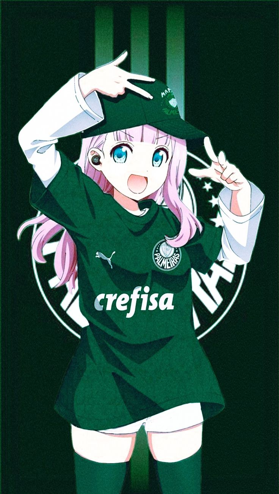

# ⚽ Anime Girls Wearing Sports Jerseys

A curated open-source dataset of anime girls wearing real-world sports jerseys.

Inspired by [Anime-Girls-Holding-Programming-Books](https://github.com/cat-milk/Anime-Girls-Holding-Programming-Books), but focused on sports culture.



---

## 📦 About

This repository contains a structured, validated collection of:

* ⚽ Football jerseys
* And more

Each entry includes structured metadata and a corresponding image.

This repository is data-focused, not an application.

---

## 📁 Repository Structure

entries/ -> JSON metadata files

images/ -> Corresponding images

---

## 🧾 Entry Format

Each entry must follow this structure:

```json
{
    "id": "mikasa-lakers-2023",
    "character": "Mikasa Ackerman",
    "anime": "Attack on Titan",
    "team": "Los Angeles Lakers",
    "sport": "Basketball",
    "year": 2023,
    "image": "images/mikasa-lakers-2023.png",
    "tags": ["nba", "lakers", "jersey"]
}
```

---

## 🧪 Validation

All contributions are automatically validated via CI.

Validation checks:

* Valid JSON format
* Required fields present
* Unique IDs
* Image exists
* No orphan images
* Image path is inside `images/`

To validate locally:

```sh
go run .
```

If validation fails, the CI will block the Pull Request.

---

## 🤝 Contributing

1. Fork the repository
2. Add your image inside `images/`
3. Add a matching JSON inside `entries/`
4. Run the validator locally
5. Open a Pull Request

Make sure:

* IDs are unique
* Images are properly named
* Metadata is accurate
* No copyrighted violations beyond fair use

See CONTRIBUTING.md for detailed guidelines. (TODO)

---

## 🚀 Generated Index

The validator generates:

generated/index.json

This file contains:

* Timestamp
* Total entries
* All validated entries

It is not versioned and is intended for use by the website. (TODO)

---

## 🌐 Future Website

A modern UI website will consume the generated index and display the gallery with filtering and search.

---
